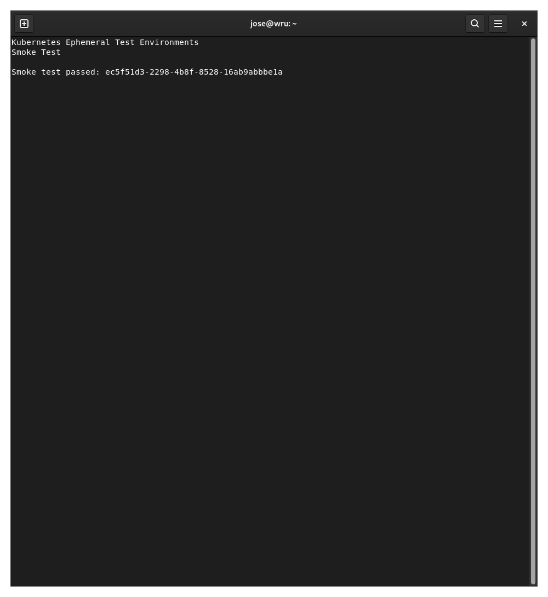

# Kubernetes Ephemeral Test Environments

DevOps portfolio project for creating isolated, short-lived Kubernetes test environments for pull requests.

## Goal

Build and scan the IOC Reputation Checker container image, deploy the API and PostgreSQL to a kind cluster with Helm, run automated smoke tests, collect diagnostic evidence, and clean up the environment.

## Application under test

- [IOC Reputation Checker](https://github.com/joseantoniocgonzalez/ioc-reputation-checker)

The application is a FastAPI backend that analyzes indicators of compromise such as IP addresses, domains, URLs and file hashes. Results are scored and stored in PostgreSQL.

## Architecture

```text
kind cluster
└── ioc-test namespace
    ├── IOC Reputation Checker API
    │   ├── PostgreSQL readiness check
    │   ├── Alembic database migrations
    │   └── ClusterIP service
    └── PostgreSQL
        ├── ClusterIP service
        ├── Kubernetes Secret
        └── PersistentVolumeClaim
```

## Implemented

- Reproducible Kubernetes cluster with kind.
- Helm chart for the API and PostgreSQL.
- Kubernetes Secret for database configuration.
- Persistent storage for PostgreSQL.
- Automatic database readiness check.
- Automatic Alembic migrations.
- API and database health checks.
- Automated end-to-end smoke test.
- Verified IOC analysis and PostgreSQL persistence.

## Smoke test

The smoke test verifies:

1. API health.
2. PostgreSQL connectivity.
3. IOC analysis.
4. Expected risk verdict.
5. Storage and retrieval of the analysis.

```bash
./tests/smoke/test_api.sh
```




## Current status

The local Kubernetes deployment and smoke test are operational.

Still pending:

- Container image security scanning.
- GitHub Actions workflow for pull requests.
- Automatic diagnostic collection on failure.
- Guaranteed environment cleanup.

## Technical decision

The initial architecture decision is documented in:

- [ADR 0001: Use kind and Helm for ephemeral test environments](docs/adr/0001-use-kind-and-helm.md)
